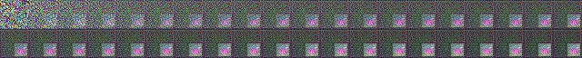
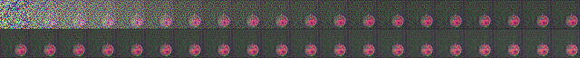

# TERD against the BadDiffusion

## Backdoor Training

Download the official code of [Baddiffusion](https://github.com/IBM/BadDiffusion) and place it in this repository. You can train a backdoor model following their instructions.

**CIFAR-10 dataset**

An example of the backdoor training Script:
```
# Trigger: STOP SIGN

# Target: CORNER

CUDA_VISIBLE_DEVICES=0 python baddiffusion.py --project CIFAR_STOP_SIGN_14_CORNER --mode train+measure --dataset CIFAR10 --batch 128 --epoch 100 --poison_rate 0.1 --trigger STOP_SIGN_14 --target CORNER --ckpt DDPM-CIFAR10-32 --fclip o -o --gpu 0
```

You can also download pre-trained checkpoints of the benign/backdoor models with the following [links](https://drive.google.com/drive/folders/1VtAaGI2RjsSIqagIBjb96Y5cQ1MkeQ8B?usp=drive_link):

- [Benign Model](https://drive.google.com/drive/folders/1MxTWQXM92_FDrgd_JRteTrdeLagnBbMH?usp=sharing)

- [BOX Trigger + HAT Target Model](https://drive.google.com/drive/folders/1bfie99--iSRYP4zNajommQgbWwkBbIWk?usp=drive_link)

- [BOX Trigger + CORNER Target Model](https://drive.google.com/drive/folders/1QJ8q4dD2A6VH0cnSWuCCWGZxuLsZtEqB?usp=drive_link)

- [BOX Trigger + SHOE Target Model](https://drive.google.com/drive/folders/1cLbzBz9IY_XBnLhGfTeatPC6SfnhLYtS?usp=drive_link)

- [STOP SIGN Trigger + HAT Target Model](https://drive.google.com/drive/folders/17MSBVh2uXCo6Dq6HQaY2HeA4VFkmh7fT?usp=drive_link)

- [STOP SIGN Trigger + CORNER Target Model](https://drive.google.com/drive/folders/1IAV7qrH6UVLdPz8-piVGPM6gDCqbH8NG?usp=drive_link)

- [STOP SIGN Trigger + SHOE Target Model](https://drive.google.com/drive/folders/1iu7G07MASRyzjpBc65VXuiCBE6H66yah?usp=drive_link)

**CELEBA-HQ dataset**

An example of the backdoor training Script (Require 2*A100 80G):
```
# Trigger: GLASSES

# Target: CAT

CUDA_VISIBLE_DEVICES=0,1 python baddiffusion.py --project CELEBA_GLASSES_CAT_5 --mode train+measure --dataset CELEBA-HQ --batch 64 --epoch 50 --poison_rate 0.5 --trigger GLASSES --learning_rate 8e-5 --target CAT --ckpt DDPM-CELEBA-HQ-256 --fclip o -o --gpu "0,1"
```

You can also download pre-trained checkpoints of the benign/backdoor models with the following [links](https://drive.google.com/drive/folders/1VtAaGI2RjsSIqagIBjb96Y5cQ1MkeQ8B?usp=drive_link):

- [Benign Model](https://drive.google.com/drive/folders/1eWbq9YsRQni7nUlbF0pvdiqCEpQUoc_U?usp=drive_link)

- [GLASSES Trigger + CAT Target Model](https://drive.google.com/drive/folders/1cLNGbF1dW5gdChbmOcffnxkdlNXvhr14?usp=drive_link)


## Trigger Reversion

**CIFAR-10 dataset:**

An example (Box trigger + Hat target):

```
CUDA_VISIBLE_DEVICES=0 python reverse.py --batch-size 16 --iteration 3000 --num_steps 10 --lr 0.5 --out-dir "./reverse_directory/" --project CIFAR_BOX_14_hat --mode measure --ckpt BOX_HAT --fclip o -o --gpu 0
```

For the commands of other settings, please refer to [`cifar_10_reverse.sh`](./cifar_10_reverse.sh) for more details.

**CELEBA-HQ dataset:**

An example (Glasses trigger + Cat target):

```
CUDA_VISIBLE_DEVICES=0 python reverse_big.py --batch-size 2 --iteration 3000 --num_steps 10 --lr 0.5 --out-dir "./reverse_directory_celebahq/" --project CELEBA_GLASSES_CAT_5 --mode measure --ckpt GLASSES_CAT --fclip o -o --gpu 0 --dataset CELEBA-HQ
```

For the commands of other settings, please refer to [`celeba_hq_reverse.sh`](./celeba_hq_reverse.sh) for more details.

### Visualization of the reversed process

Grey Box



Stop Sign



## Model Detection

**CIFAR-10 dataset:**

An example (Box trigger + Hat target):

```
CUDA_VISIBLE_DEVICES=0 python model_detection.py --path "./reverse_directory/CIFAR_BOX_14_hat/log_5e-05_10_3000_16_0.5/reverse.pkl"
```
For the commands of other settings, you can refer to [`cifar_10_model.sh`](./cifar_10_model.sh) for more details.

**CELEBA-HQ dataset:**

An example (Glasses trigger + Cat target):

```
CUDA_VISIBLE_DEVICES=0 python model_detection.py --path "./reverse_directory_celebahq/CELEBA_GLASSES_CAT_5/log_0.0005_10_3000_2_0.5/reverse.pkl"
```
For the commands of other settings, you can refer to [`celeba_hq_model.sh`](./celeba_hq_model.sh) for more details.

## Input Detection

**CIFAR-10 dataset:**

An example (Box trigger + Hat target):

```
CUDA_VISIBLE_DEVICES=0 python input_detection.py --reverse_path "./reverse_directory/CIFAR_BOX_14_hat/log_5e-05_10_3000_16_0.5/reverse.pkl"  --trigger CIFAR_BOX_14_hat --ckpt BOX_HAT --fclip o -o --gpu 0
```
For the commands of other settings, you can refer to [`cifar_10_input.sh`](./cifar_10_input.sh) for more details.

**CELEBA-HQ dataset:**

An example (Glasses trigger + Cat target):

```
 CUDA_VISIBLE_DEVICES=0 python input_detection.py --reverse_path "./reverse_directory_celebahq/CELEBA_GLASSES_CAT_5/log_0.0005_10_3000_2_0.5/reverse.pkl" --project CELEBA_GLASSES_CAT_5 --ckpt GLASSES_CAT --fclip o -o --gpu 10
```

For the commands of other settings, you can refer to [`celeba_hq_input.sh`](./celeba_hq_input.sh) for more details.

**Result:**

CIFAR-10

|Setting|TPR|TNR|
|--|--|--|
|BOX-HAT|100%|100%|
|BOX-SHOE|100%|100%|
|BOX-CORNER|100%|100%|
|STOP-HAT|100%|100%|
|STOP-SHOE|100%|100%|
|STOP-CORNER|100%|100%|

CELEBA-HQ

|Setting|TPR|TNR|
|--|--|--|
|GLASSES-CAT|100%|100%|

